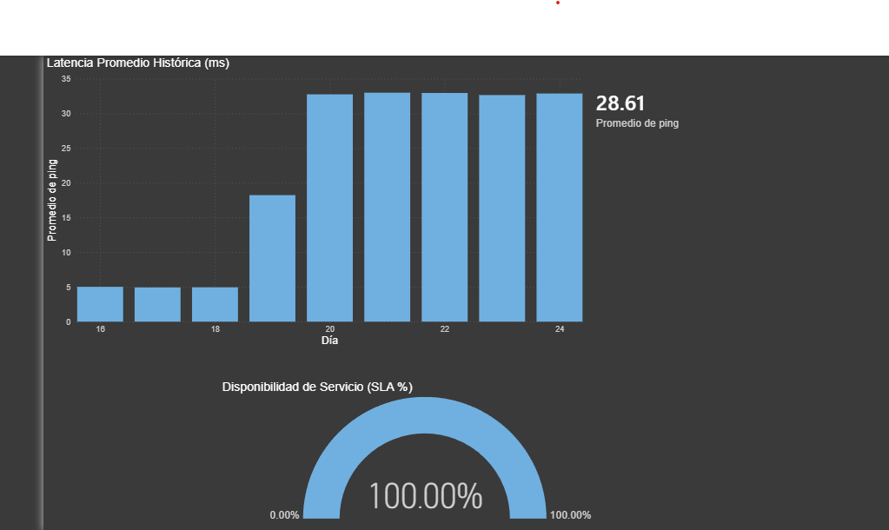

# Monitoreo de la Infraestructura de un Servidor Casero (SLA & Latencia)

Este proyecto consiste en la implementación de una arquitectura de obervabilidad para un servidor personal basado en **Ubuntu Server** y **Docker**, visualizando métricas críticas en **Power BI**.

  

## Tecnologías 
* **SO:** Ubuntu Server 24.04 LTS (Homelab).
* **Containerización:** Docker & Portainer.
* **Monitoreo:** Uptime Kuma (SQLite DB).
* **BI & Data:** Power BI Desktop + Excel (Proceso ETL).

## Dashboard de Observabilidad 
El reporte final permite monitorear: 
1.  **SLA (Service Level Agreement):** Porcentaje de disponibilidad de servicios críticos (Nextcloud).
2.  **Latencia Histórica (ms):** Análisis de rendimiento y picos de demanda.
3.  **Análisis de Tendencias:** Correlación entre el uso de recursos y tiempos de respuesta.

## Notas Finales
Este proyecto se realizo mediante datos reales proporcionados por mi servidor personal, el proceso de ETL incluyó la limpieza y transformación de métricas (conversión de Unix Timestamp a formatos legibles) y el uso de DAX (Data Analysis Expressions) para calcular indicadores clave de disponibilidad.
